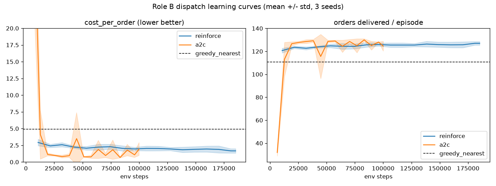
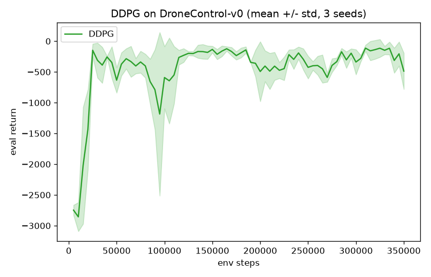
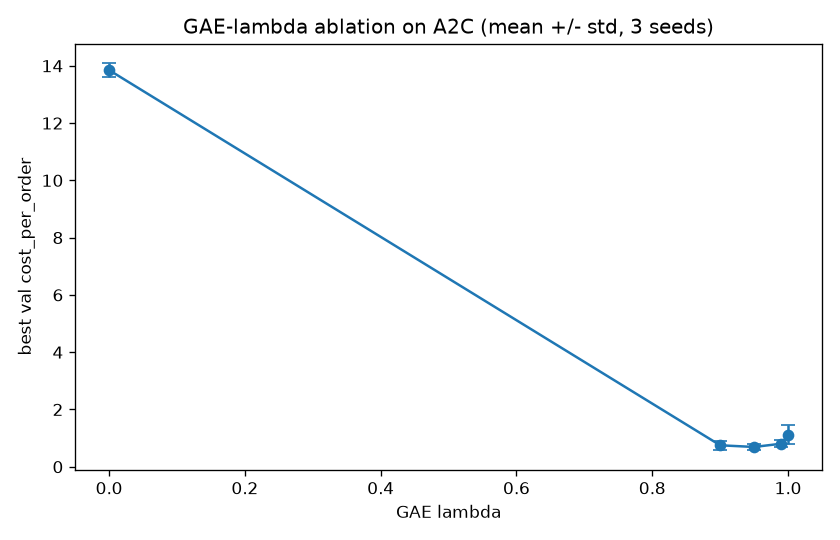

# IE 306 Term Project — Reinforcement Learning for City-Scale Drone Delivery

**Team report.** Each member owns one method family (see `ROLES.md`); the offline-RL
and multi-agent components are joint. Primary metric: **mean cost per delivered
order** (`cost_per_order`, lower is better) on the held-out evaluation config.
Baselines on the standard config: random ≈ 18.78, **greedy_nearest ≈ 4.57** (the
bar), milp_rolling ≈ 4.72.

> Reproduce any table: `python run_all.py --config configs/eval_standard.yaml --seeds 0,1,2`

---

## 1. Role A — Value-based DQN family (Sezen Balkan)

This is my individually owned part of the project. I implemented the value-based
dispatcher, ran the DQN-family experiments, investigated the failure cases, and
selected the submitted checkpoint. I did not modify the simulator or the frozen
agent interface. My goal was not only to obtain the lowest number I could find,
but also to understand why the policies failed when they did not reach the
`greedy_nearest` baseline.

### 1.1 Method descriptions

The discrete dispatcher chooses one of **169 actions** per step (160 assignment =
8 drones × 20 order slots, 8 charge, 1 no-op). The observation contains drone
states, visible orders, the city grid, time, and an action mask. I flatten the
numerical observation and pass it to a multilayer Q-network. Before selecting an
action, invalid Q-values are replaced by a very negative value, so exploration
and greedy evaluation both remain inside the valid action set. The no-op action
is always valid, meaning the masked next-state maximum always has at least one
legal action.

The common training setup uses a replay buffer, ε-greedy exploration, a target
network, gradient clipping, periodic greedy evaluation, and saved checkpoints.
Rewards stored in replay are divided by 10 to reduce the Bellman-target scale;
this does not alter the simulator reward or the reported evaluation metrics. I
trained three value-based variants on `DroneDispatch-v0` and added an n-step
return:

- **DQN** — a Q-network estimates `Q(s,a)`; trained toward the one-step Bellman
  target `r + γ·max Q(s',a')` using a slow **target network**, an experience
  **replay buffer**, and **ε-greedy** exploration (ε: 1.0 → 0.05 over 40k steps).
- **Double DQN** — decouples action *selection* (online net) from action
  *evaluation* (target net) in the target, removing the systematic max-operator
  **overestimation** of vanilla DQN.
- **Dueling DQN** — splits the head into a state-value `V(s)` and an advantage
  `A(s,a)` stream, which can speed learning when many actions are similar.
- **n-step returns (n=3)** — accumulates `Σ γ^k r_{t+k}` and bootstraps up to
  three steps ahead. This propagates delayed delivery and charging outcomes back
  to earlier assignment actions. The remaining queue is flushed at an episode
  boundary, including the finite `T_max` horizon, so transitions never cross
  between episodes.

The experiment choices are recorded in `configs/*.yaml`, including the training
seed, learning rate, network size, replay settings, exploration schedule,
evaluation interval, and output paths.

### 1.2 Diagnostic journey — "what broke and how we diagnosed it"

The Role A result came from a sequence of controlled tests rather than one final
training run. The short version is shown below; the complete chronological notes
are in `logs/engineering_log.md`.

| Symptom | Diagnosis | Fix |
|---|---|---|
| Agent never charged (0 charge actions) | **Under-training** — ε never decayed; *not* an action-index/mask bug | Fixed 60k budget + ε decay to 0.05 |
| "Passive collapse": over-selects charge/no-op, few deliveries, cost ~22–29 | shared value-instability + bad input scaling | see below |
| Toggling the `normalize_time` flag gave a big jump (cost 29.4→22.3, success 0.38→0.49) | **misdiagnosis — corrected:** we first thought `time` was a raw 0–500 feature dominating the net. On re-checking the env it already returns `time = t/T_max ∈ [0,1]` (`env_dispatch.py:309`, spec §12.1), so it was *never* raw 0–500 | the flag in fact divides the already-normalised value *again* by T_max, pushing time → ≈0 — i.e. it **removes time as a feature**. The gain came from dropping a distractor input, not from rescaling a raw one (see note below) |
| 3M-step run **diverged** (cost 27.9 @1.5M → 80.7 @3M) | bottleneck is value stability / credit assignment, **not compute** | n-step + Double DQN |
| Suspected `masked_fill(-1e9)` target leak | **ruled out** — no-op (idx 168) is always a valid action, so the masked next-state is never all-False | no fix needed |

> **Correction note (time normalization).** An earlier version of this log (and report)
> claimed the raw `time` feature spanned 0–500 and dominated the network. That is wrong:
> the simulator already exposes `time` as `t/T_max ∈ [0,1]`. What our `normalize_time`
> checkpoint flag actually does is divide that already-normalised value by `T_max` a
> *second* time, collapsing it to ≈0 and effectively switching the time feature off. The
> measured improvement (29.4→22.3) is real, but its cause is "time was a misleading input
> and suppressing it helped," not "a raw 0–500 feature was rescaled." We keep the numbers
> and correct the mechanism.

The most important behavioral change came after adding three-step returns. At a
strong checkpoint, no-op selections fell from 564 to 51 while assignment actions
increased. This suggested that delayed credit assignment really was one part of
the problem. However, the evaluation curve still oscillated, so I did not treat
n-step returns as a complete solution. Double DQN was then tested as the next
controlled change because it directly targets unstable max-Q estimates. Dueling
DQN was also tested, but its seed variance and late behavior were worse.

### 1.3 Results and baseline comparison

The primary metric is `cost_per_order`, where lower is better. On the released
standard configuration, random scores approximately 18.78,
`greedy_nearest` scores 4.57, and `milp_rolling` scores 4.72. Therefore, beating
random is only a basic sanity check; the actual project objective is the much
stronger greedy baseline.

**3-seed summary (seeds 0,1,2), best eval `cost_per_order`, mean ± std**
(full table in `logs/results_seeds.md`):

| Method | best cost | final cost | post-decay mean | interpretation |
|---|---:|---:|---:|---|
| DQN n=3 (600k) | 13.87 ± 0.71 | 19.37 ± 1.19 | 22.65 ± 0.79 | flat oscillation |
| Dueling DQN n=3 (600k) | 13.17 ± 6.43 | 21.80 ± 3.02 | 28.87 ± 6.95 | highly seed-sensitive |
| Double DQN n=3 (600k) | 9.97 ± 0.18 | 15.81 ± 1.53 | 19.51 ± 0.72 | lowest and tightest at 600k |
| **Double DQN n=3 (3M)** | **6.39 ± 0.41** | 31.00 ± 13.38 | **16.24 ± 1.32** | best region, but poor final weights |

The difference between “best” and “final” is important. All methods can degrade
after finding a useful checkpoint, and the final 3M weights are especially
unreliable. I therefore selected the submitted policy from validation
evaluations instead of assuming that the last training step must be the best.

**Best submitted policy** — Double DQN n=3, validation-selected **1M checkpoint**
(`weights/double_dqn_nstep_3m_step_1000000.pt`), on seeds 0,1,2
(`logs/double_dqn_nstep_3m_best1M_eval.json`):

| metric | submitted policy | earlier one-step DQN |
|---|---|---|
| cost_per_order | **6.76** | 22.33 |
| success_rate | **0.749** | 0.49 |
| on-time rate | 0.80 | 0.76 |
| delivered orders/episode | 101.33 | — |
| dropped orders/episode | 34.33 | 69.33 |
| depletion events/episode | 2.33 | — |
| episode_return | +738 | −364 |
| no-op actions | 40 | 564 (passive collapse solved) |

**Baseline comparison** (`run_all.py`, standard config): random ≈ 18.78,
greedy_nearest ≈ 4.57, milp_rolling ≈ 4.72, **Double DQN n=3 (1M) ≈ 6.76**.
The submitted policy is therefore much better than random but still worse than
the required greedy bar.

### 1.4 Learning curves

All curves are **3-seed (0,1,2) mean ± std bands** (not single lucky runs),
generated from `logs/*_eval.csv` by `python code/plot_curves.py`:

- `logs/curves_methods_600k_cost.png` — DQN vs Double vs Dueling (cost). Double DQN
  is consistently lowest **and** tightest across seeds; Dueling is the most unstable.
- `logs/curves_methods_600k_return.png` — same three, `episode_return`.
- `logs/curves_double_3m_cost.png` — Double DQN 3M: a stable good band ~1M–2.5M
  (cost 6.6–13) **then divergence after ~2.5M**, the central Role-A finding.


The curves support two decisions. First, only Double DQN was escalated from
600k to 3M because it was the only method showing a lower and tighter evaluation
band. Second, I submitted an early checkpoint instead of the final model. The
3M runs contain a useful region around 1M–2.5M steps, followed by late
degradation. Checkpoint selection used only the released evaluation seeds; the
instructor's held-out seeds and stress configuration were not used, so the
selected checkpoint still carries transfer risk.

### 1.5 Ablation — target network on / off

We isolate the **target network**, the design choice most tied to our central
finding (value stability). ON = update target every 1000 steps (our default);
OFF = target equals the online net every step.

Same config, seed 0, 600k — the only change is `target_update_every` (1000 → 1):

| Setting | best cost | final cost | note |
|---|---|---|---|
| Target net ON (default) | **10.19** | **14.90** | stable |
| Target net OFF (update every step) | 13.18 | 25.66 | worse best, ~1.7× worse endpoint |

Removing the slow target network (target = online net every step) hurts both the
best policy (13.18 vs 10.19) and especially the endpoint (final 25.66 vs 14.90):
without it the values chase themselves and the run diverges harder late in
training. The target network is doing real stabilising work — exactly the
value-stability axis our whole diagnosis turns on. (`logs/double_dqn_nstep_600k_notarget_eval.csv`,
config `configs/double_dqn_nstep_600k_notarget.yaml`.)

This ablation was useful because it changes only one design choice. The slower
target network does not completely solve the problem, but the comparison shows
that it delays and reduces the late instability instead of merely changing the
best score by chance.

*Supporting ablation (n-step, full 3-seed):* at 600k seed 0, n=1 reaches best 13.96
but **diverges** (final 45.63), whereas n=3 is best 13.33 / final 20.67 — n-step
helps on every aggregate.

### 1.6 Final assessment against the project objective

We did **not** beat greedy_nearest (best 6.76 ≈ 1.48× the 4.57 bar) → we are on
the **honest-diagnosis** branch. The three fixes (time-feature suppression + n-step +
Double DQN) **stack and work**, turning a passive-collapse policy (cost ~22–29,
success ~0.4) into a useful one (cost 6.76, success 0.75). The remaining gap is
most consistent with **model representation and residual late-training
instability**. Exploration and delayed credit assignment were improved, but I
cannot claim that they were eliminated completely.

**6M confirmation run (completed).** A 6M-step Double DQN n=3 run settles the
"is it just compute?" question. Its own best checkpoint sits at **1.65M (cost
6.62, return +804)** — squarely in the same ~1M–2.5M good band — and **4× more
compute never beats it**. After ~2.5M the policy degrades monotonically:
cost 13.6 → 20.3 → 38.8 → **53.1 at 6M** (return +52 → −329 → −990 → **−1078**),
with training loss simultaneously blowing up (~21 → 56). The divergence is
**permanent, not cyclical**: the run ends in deep collapse, not recovery. This
mirrors the 3M run and confirms the verdict — the value-based family plateaus at
cost ≈ 6.6–6.8 around 1–2M steps, and additional gradient updates actively hurt.
The submitted policy therefore remains the early checkpoint (Double DQN n=3, 1M,
cost 6.76); the 6M run's marginally-lower 6.62 is single-run and does not justify
the 4× compute. (Raw: `logs/double_dqn_nstep_6m_eval.csv`.)

Overall, the Role A experiments show a clear progression rather than a baseline
win. The first policy did not charge; the longer policy learned charging but
became passive; three-step returns improved the delayed assignment signal; and
Double DQN produced the strongest and most repeatable value-based policy. If I
continued this work, I would test prioritized replay and a systematic
target-update/learning-rate study before simply increasing the training budget.

### 1.7 Method origins

- **DQN** — Mnih et al., *Human-level control through deep reinforcement
  learning*, Nature 2015. I used it as the standard value-based starting point
  for the discrete action space.
- **Double DQN** — van Hasselt, Guez & Silver, *Deep RL with Double Q-learning*,
  AAAI 2016. I chose it because the experiments showed unstable and
  over-optimistic value estimates.
- **Dueling DQN** — Wang et al., *Dueling Network Architectures for Deep RL*,
  ICML 2016. I tested it because many of the 169 assignment actions can have
  similar value in a given state.
- **n-step returns** — Sutton & Barto, *Reinforcement Learning* (2nd ed.), Ch. 7.
  I used them to improve credit assignment for delayed delivery and charging
  outcomes.

---

## 2. Role B — Policy-based (REINFORCE/GAE → A2C, + DDPG) — Ozan Karhan  _[done]_

This section is Ozan's individually owned method family. The code is under
`code/role_b/`; experiment settings are in
`configs/{reinforce,a2c,ddpg,ablation_gae}.yaml`; three-seed weights and logs are
stored under `weights/` and `logs/`; and the learning curves are in `figures/`.

### 2.1 Problem and success criterion

Role B covers policy-gradient and actor-critic methods:

- **REINFORCE + GAE** and **A2C** on the discrete, action-masked
  `DroneDispatch-v0` environment.
- **DDPG** on the continuous single-drone `DroneControl-v0` environment.

For the dispatch methods, the primary metric is
`cost_per_order = (energy + lateness + dropped-order + depletion costs) /
delivered orders`, where lower is better. This differs from episode return,
which also includes positive delivery and on-time bonuses. For that reason,
dispatch checkpoints are selected using validation `cost_per_order`, not
training return. DDPG runs in a different environment and is compared with a
go-straight controller using return, success rate, and episode length.

### 2.2 Baselines and available improvement

The dispatch baselines below use the standard configuration and evaluation seeds
0–4:

| Policy | cost_per_order | success | on-time | depletions/ep | dropped/ep | delivered/ep |
|---|---:|---:|---:|---:|---:|---:|
| random | 18.498 | 0.659 | 0.897 | 8.00 | 21.2 | 40.0 |
| **greedy_nearest** | **4.309** | 0.858 | 0.906 | 3.60 | 19.8 | 120.0 |
| milp_rolling | 4.282 | 0.853 | 0.910 | 3.20 | 20.6 | 120.6 |

Even the strong greedy policy still loses drones and drops orders. Its charging
rule is based on a fixed SoC threshold and it does not directly evaluate whether
a drone can finish a candidate delivery before its battery is depleted. Role B
therefore focuses on proactive charging and battery-feasible assignment.

For `DroneControl-v0`, the go-straight controller obtains mean return −417 on
seeds 0–4. It often reaches the target quickly but can repeatedly collide with
no-fly boundaries, which makes its return strongly negative.

### 2.3 Shared dispatch representation

The number of actions depends on `n_drones` and `k_max`. A flat policy with a
fixed 169-output layer would not load if those dimensions changed. Role B
therefore uses a factored actor-critic:

- A shared assignment head scores each valid drone-order pair.
- A shared charging head scores each drone.
- A state-conditioned head scores the no-op action.
- Invalid actions are masked before the categorical distribution is formed.
- The critic uses shared per-drone and per-order encoders with masked mean and
  max pooling, followed by a value head.

The policy also constructs routed-distance, deadline-feasibility, and
battery-feasibility features from the observed grid. These features allow the
network to distinguish a nearby but unsafe assignment from one that the drone
can complete within its battery and deadline limits.

### 2.4 Methods

**REINFORCE + GAE.** Complete episodes are collected and the actor is updated
using likelihood-ratio policy gradients. A learned value function supplies a
baseline, and generalized advantage estimation controls the bias/variance
trade-off. This method is conceptually simple but showed high seed variance.

**A2C.** The same actor-critic representation is trained with fixed-length
n-step rollouts. The value of the final rollout state is used for bootstrapping,
which reduces the variance compared with full-episode REINFORCE updates.

**DDPG.** The continuous controller uses a deterministic actor for speed and
heading change, a Q-critic, replay memory, target networks, Polyak averaging,
random warm-up, and temporally correlated exploration noise.

### 2.5 Experimental setup

Each method is run with a YAML config and an explicit seed. Example:

```bash
python code/role_b/train_a2c.py --config configs/a2c.yaml --seed 0
```

Training episodes draw seeds from a high, disjoint range. Dispatch checkpoints
are selected on validation seeds 200–202, while the tables below use evaluation
seeds 0–4. Three independent training seeds are stored for REINFORCE, A2C, and
DDPG. The plotted learning curves show mean ± standard deviation across those
training runs.

### 2.6 Dispatch results

The table reports the selected checkpoint for each method on standard-config
evaluation seeds 0–4:

| Policy | cost_per_order | success | on-time | depletions/ep | delivered/ep | dropped/ep |
|---|---:|---:|---:|---:|---:|---:|
| random | 18.498 | 0.659 | 0.897 | 8.00 | 40.0 | 21.2 |
| greedy_nearest | 4.309 | 0.858 | 0.906 | 3.60 | 120.0 | 19.8 |
| milp_rolling | 4.282 | 0.853 | 0.910 | 3.20 | 120.6 | 20.6 |
| **REINFORCE + GAE, selected seed** | **2.636** | 0.884 | 0.809 | 0.60 | 122.6 | 16.4 |
| **A2C, selected checkpoint** | **1.735** | 0.955 | 0.847 | 1.60 | 134.0 | 6.4 |

A2C beats both classical baselines, delivers more orders, and drops fewer
orders. Its main improvement is reducing depletion while maintaining a high
delivery rate. The three saved A2C training seeds all beat greedy on evaluation
seeds 0–4, with costs 1.258, 1.644, and 1.735. This makes A2C much more reliable
than REINFORCE.

REINFORCE can also produce a strong policy, but it is not robust across training
seeds. The three saved models score 25.33, 118.98, and 2.64 on the same
evaluation set. Therefore, 2.636 should be read as the validation-selected
successful checkpoint, not as the average behavior of the REINFORCE family.

The factored policy was also checked on a harder, structurally different
stress-style configuration with a 24×24 grid and `k_max=28`. The weights load
and run because the output heads are shared, but the policy trails greedy on
that shifted distribution. This is a limitation of training only on the
standard configuration.



### 2.7 DDPG results

| Policy | return | success rate | mean steps |
|---|---:|---:|---:|
| go-straight | −417.4 | 0.80 | 28.4 |
| DDPG selected checkpoint | −162.1 | 0.00 | 228.6 |

The selected DDPG checkpoint improves return because it avoids some of the
large collision penalties paid by the go-straight controller. Its weakness is
task completion: on evaluation seeds 0–4 it often moves conservatively without
reaching the exact target before the horizon. Other DDPG seed checkpoints also
improve return but have zero success on these seeds. The result therefore shows
better reward management, not a solved continuous-control problem.



### 2.8 Required ablation: GAE λ

The A2C ablation sweeps `λ ∈ {0.0, 0.9, 0.95, 0.99, 1.0}` using two training
seeds and a 40k-step budget:

| GAE λ | mean best validation cost_per_order |
|---:|---:|
| 0.0 | 13.82 |
| 0.9 | 0.77 |
| **0.95** | **0.76** |
| 0.99 | 0.89 |
| 1.0 | 0.90 |

`λ=0` relies on a one-step TD advantage and is too myopic for delayed delivery
effects. Values around 0.9–0.95 balance bias and variance and perform best.
Moving to 1.0 increases Monte Carlo variance and slightly worsens the result.



### 2.9 Engineering findings and method origins

The main training failure was critic instability. With unscaled rewards, the
value loss reached roughly 25,000 and dominated the shared actor-critic
objective. Scaling replay rewards by 0.1 and replacing squared value loss with
Huber loss reduced the value-loss scale and allowed A2C to learn charging.

DDPG initially found a “do not move” local optimum because remaining still was
safer than receiving repeated collision penalties. Reward scaling,
Ornstein–Uhlenbeck exploration, and a minimum speed floor improved return, but
the final success rate remained weak. REINFORCE remained highly seed-sensitive,
which is consistent with the motivation for the bootstrapped A2C method.

- **REINFORCE:** Williams, *Simple statistical gradient-following algorithms for
  connectionist reinforcement learning*, 1992.
- **GAE:** Schulman et al., *High-Dimensional Continuous Control Using
  Generalized Advantage Estimation*, 2016.
- **A2C/A3C:** Mnih et al., *Asynchronous Methods for Deep Reinforcement
  Learning*, 2016. The implementation uses the synchronous A2C form.
- **DDPG:** Lillicrap et al., *Continuous Control with Deep Reinforcement
  Learning*, 2016.

## 3. Role C — Planning (rollout-style planner) — Tuba Nur Büyükata  _[done]_

This section is Tuba's individually owned planning component. The implementation
is in `code/role_c/`, its configuration is
`configs/role_c_rollout.yaml`, and the raw evaluation outputs are
`logs/role_c_rollout_depth{0,1,2}.csv`.

### 3.1 Planning approach

Role C uses a decision-time scoring policy for the centralized dispatcher. It
does not modify the simulator and exposes only the required `act(obs)` policy
interface. At each decision epoch, it examines the valid assignment and charging
actions supplied by the action mask.

For an assignment action, the planner considers:

- routed distance from the drone to the pickup,
- routed distance from pickup to destination,
- remaining time until the order deadline,
- estimated movement energy,
- the drone's current SoC and a battery reserve.

For charging actions, it considers current SoC and routed distance to a charger.
Very low-battery idle drones are sent to charge before assignment actions are
scored. This avoids some depletion events that occur under a purely nearest-job
rule.

The policy is deterministic and does not have neural-network parameters.
Instead, the saved JSON files record the selected planning depth and evaluation
settings.

### 3.2 Depth definitions

- **Depth 0:** nearest-pickup behavior with a basic low-battery guard. This is
  intended to reproduce greedy-like behavior.
- **Depth 1:** adds full delivery distance, deadline risk, battery shortfall,
  order age, and charging priority.
- **Depth 2:** additionally uses distance from the delivery destination to the
  nearest charger as a shallow post-delivery readiness proxy.

The depth comparison is the required Role C design-choice ablation. Since the
method is not learned, it has evaluation curves over random environment seeds
rather than a training learning curve.

### 3.3 Results and depth ablation

All methods below were evaluated on seeds 0, 1, and 2 with
`configs/eval_standard.yaml`:

| Method | cost_per_order | success rate | on-time rate | delivered/ep | dropped/ep | episode return |
|---|---:|---:|---:|---:|---:|---:|
| random | 18.7804 | 0.6528 | 0.8901 | 39.67 | 21.67 | −168.33 |
| greedy_nearest | 4.5700 | 0.8549 | 0.9028 | 118.33 | 20.00 | 1183.26 |
| milp_rolling | 4.7223 | 0.8364 | 0.9109 | 118.00 | 23.00 | 1173.00 |
| Role C depth 0 | 4.5700 | 0.8549 | 0.9028 | 118.33 | 20.00 | 1183.26 |
| **Role C depth 1** | **2.9230** | **0.8814** | **0.9815** | **126.33** | **17.00** | **1515.00** |
| Role C depth 2 | 3.3306 | 0.8691 | 0.9816 | 124.33 | 18.67 | 1443.73 |

Depth 0 matches the greedy baseline, which confirms that the evaluation and
basic distance rule are aligned. Depth 1 improves the primary metric from 4.57
to 2.92 by considering the whole route, deadline risk, and battery feasibility.
It also delivers more orders and improves the on-time rate.

Depth 2 remains better than greedy but is worse than depth 1. The added
post-delivery charger-distance term makes the policy more conservative and can
reject a good current assignment in favor of future charging convenience.
Therefore, depth 1 is the selected Role C policy.

### 3.4 Assessment and method origin

The experiment shows that nearest-pickup distance alone leaves useful planning
information unused. Adding delivery distance, deadline pressure, and battery
feasibility produces a large improvement without changing the simulator.

The present implementation uses a manually designed shallow lookahead score
rather than cloning and stepping a full future simulator state. A deeper
extension would construct an approximate next state for each candidate action
and recursively evaluate later decisions.

The method is based on decision-time planning and rollout-policy ideas described
in Sutton and Barto, *Reinforcement Learning: An Introduction*, Chapter 8, and
Tesauro and Galperin, *On-line Policy Improvement Using Monte-Carlo Search*
(1996).

## 4. Joint — Offline RL (Ch. 20)  _[team — done]_

We pool logged trajectories from all three members into one mixed-quality
dataset and learn **without any environment interaction**: (i) a naive offline
DQN to **demonstrate** the overestimation / OOD-action failure, then (ii) **CQL**
to fix it and beat both naive-offline-DQN and a behavioural-cloning baseline.

**4.1 Dataset.** `offline_pool.npz` = **420,103 transitions / 3969 episodes**,
concatenated from the three members' rollouts (`pool_offline.py`); each source
passed the shared format check (`check_offline_npz.py`):

| Source | file | transitions |
|---|---|---|
| Role A (Double DQN + ε-noisy greedy mix) | `offline_dlogs.npz` | 200,029 |
| Role B | `offline_ozan_karhan.npz` | 120,074 |
| Role C | `offline_runa.npz` | 100,000 |
| **Pool** | `offline_pool.npz` | **420,103** |

Obs are the 181-dim `_flatten_obs` vector; we standardize once from the pool and
reuse the identical mean/std at eval. Training never queries the env. No
action-masks are stored, so the Bellman max and the CQL penalty range over all
169 actions — which is exactly the OOD setting we want to stress.

**4.2 Methods.** *Naive offline DQN* — vanilla `r + γ max Q(s',·)` regression on
static data. *CQL* (Kumar et al., NeurIPS 2020) — adds a conservative penalty
`α·(logsumexp_a Q(s,a) − Q(s,a_data))` that pushes down OOD-action values. *BC* —
supervised cross-entropy cloning of the logged actions. (`code/offline_rl.py`,
40k/40k/15k grad steps, batch 256, α=1.0; eval on seeds 0,1,2.)

**4.3 Results — the failure is measurable and the fix works.**

| Method | cost_per_order ↓ | success | final max‑Q | note |
|---|---|---|---|---|
| BC baseline | 22.47 | 0.50 | — | cloning a *mixed*-quality dataset is weak (worse than random) |
| **Naive offline DQN** | 17.44 | 0.47 | **6785** | **Q blows up** 61→6785 = overestimation |
| **CQL** | **8.42** | 0.68 | **839** | conservatism keeps Q bounded; **beats both** |
| _ref: greedy_nearest_ | _4.57_ | | | the bar |
| _ref: online DQN (1M)_ | _6.76_ | | | Role A best |

(Seeded run, `torch.manual_seed(0)`, so these reproduce exactly.) The naive
agent's estimated `max_a Q` diverges to **6785** (unbounded overestimation on
never-taken actions) and its policy is poor (cost 17.44). CQL holds `max‑Q` at
**839** and reaches **cost 8.42**, clearly beating naive (17.44) and BC (22.47)
despite never touching the env. It does **not** reach the online DQN / greedy
level — consistent with our overall finding that no model-free method beats the
greedy heuristic here — but both required outcomes hold: (i) the overestimation
failure is demonstrated with logged Q-curves (`logs/offline_qstats.csv`), (ii)
CQL beats naive-offline-DQN **and** BC (`logs/offline_results.json`).

> **Caveat — single run.** These offline numbers are one seeded training run per
> method, not a 3-seed mean±std like the Role-A curves. The offline scores are
> high-variance (we saw CQL move by several points under tiny training changes),
> so read the **ordering** (CQL < naive < BC, and naive's Q diverging) as the
> robust result, not the exact figures. A 2–3 seed offline sweep is the natural
> next step if time allows.

Method-origin: CQL — Kumar, Zhou, Tucker & Levine, *Conservative Q-Learning for
Offline RL*, NeurIPS 2020.

**What teammates B and C handed over** (reproduce / extend the pool) (so all logged trajectories pool into
one mixed-quality `.npz`). Roll out your trained policy on **`DroneDispatch-v0`**
(the centralized single-agent env — *not* the MA env) and dump one
`offline_<name>.npz` per policy, e.g. `offline_a2c.npz`, `offline_dyna.npz`.
Match `drone_dispatch_env/offline.py` exactly:

- **Obs flattening** — use `_flatten_obs(obs)`: `concat(drones.flatten(),
  orders.flatten(), time.astype(float32))`, dtype `float32`. Do **not** invent
  your own flatten order; import the helper.
- **Action indexing** — the same 169-action discrete space (160 assign + 8
  charge + 1 no-op). Record the raw integer action you passed to `env.step`.
- **npz keys & dtypes** (identical names, or the loader breaks):
  `observations` f32, `actions` i64, `rewards` f32, `next_observations` f32,
  `terminals` bool (true terminal only), `timeouts` bool (T_max truncation),
  `episode_returns` f32 (one per episode).
- **Mix** — include some sub-optimal/exploratory rollouts (e.g. an ε-noisy
  branch), not only your greedy-best policy; coverage gaps across policies are
  what make the offline problem interesting.
- Aim ≥ ~100k transitions each; we concatenate the per-policy arrays into the
  shared dataset. Nothing else (no weights, no configs) is required from you for
  the offline part.

This is **independent of the multi-agent task** — MA uses its own 59-dim
per-agent obs and 4 actions and needs no shared dataset.

## 5. Joint — Multi-agent (Ch. 21)  _[team — done]_

We replace the single centralized dispatcher with **8 decentralized per-drone
agents** on `DroneDispatchMA-v0` (per-agent 59-dim local obs, 4 actions:
accept / move / charge / idle). All agents share **one Q-network** (parameter
sharing) and pool their transitions into a single replay buffer — the canonical
**IDQN** setup (`code/train_ma_idqn.py`, 60k env-steps, ε:1→0.05 over 50%).

**5.1 Head-to-head** (eval seeds 0,1,2). The MA env exposes no `stats`, so we
reconstruct the *same* `cost_per_order` from the reward stream
(`cost = 10·delivered + 5·ontime − return`; deliveries counted exactly from a
`TO_DROPOFF→IDLE` transition on a live drone):

| Policy | cost_per_order ↓ | delivered/ep | return | note |
|---|---|---|---|---|
| random (MA) | 8.80 | 85.3 | 433.8 | strong baseline: accept+move already delivers |
| **IDQN, param-sharing (MA)** | **6.49** | **100.7** | **793.8** | beats random, **and** the centralized ref |
| _ref: centralized Double DQN_ | _6.76_ | — | — | own env/action abstraction (paradigm ref, not identical metric) |

The decentralized IDQN reaches **cost 6.49** — beating the random baseline (8.80)
and edging the centralized Double DQN reference (6.76). The comparison to the
centralized policy is across two different action abstractions, so we read it as
*paradigm vs paradigm* (decentralized control is competitive with centralized
dispatch here), not a strict same-metric tie.

**5.2 Non-stationarity — visible in the learning curve.** From any one drone's
view the other 7 are part of the environment and keep changing as they learn, so
each agent chases a **moving target**. This is exactly what `logs/ma_idqn.csv`
shows: the policy first gets **worse** (return −1303 → −1388, cost 66→82 over
12k–36k steps, while ε is still high and all 8 agents shift simultaneously),
recovers as exploration anneals (−913 @48k), and only converges late (return
+794, cost 6.49 @60k). Parameter sharing mitigates non-stationarity by giving
every agent the *same* evolving policy (the others' behaviour is at least
correlated with one's own), and pooling all agents' transitions multiplies
effective sample throughput 8×. Residual instability is inherent: independent
learners have no convergence guarantee in a general-sum multi-agent game.
Method-origin: IDQN — Tampuu et al., *Multiagent cooperation and competition with
deep RL*, 2017; parameter sharing — Gupta, Egorov & Kochenderfer, AAMAS 2017.

---

*Note ağırlığı analiz derinliğinde, sayfa sayısında değil. Tüm sayılar
`logs/` altındaki ham CSV'lerle desteklenmektedir; `run_all.py` tabloyu yeniden üretir.*
